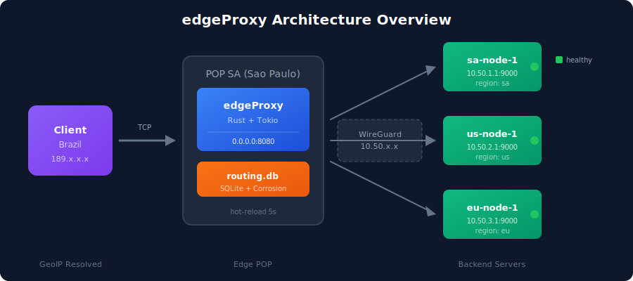
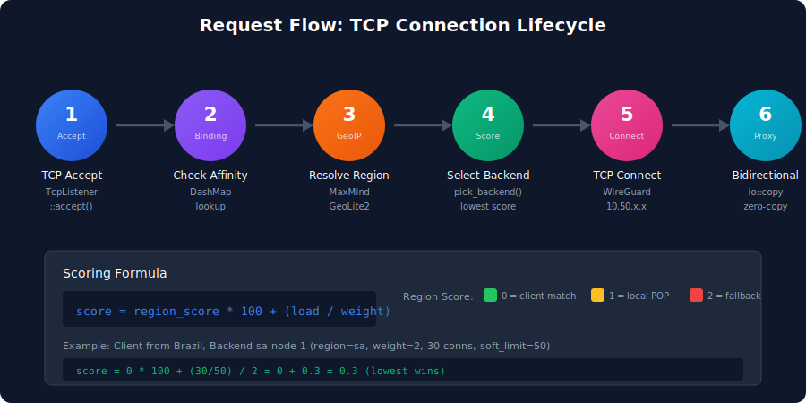
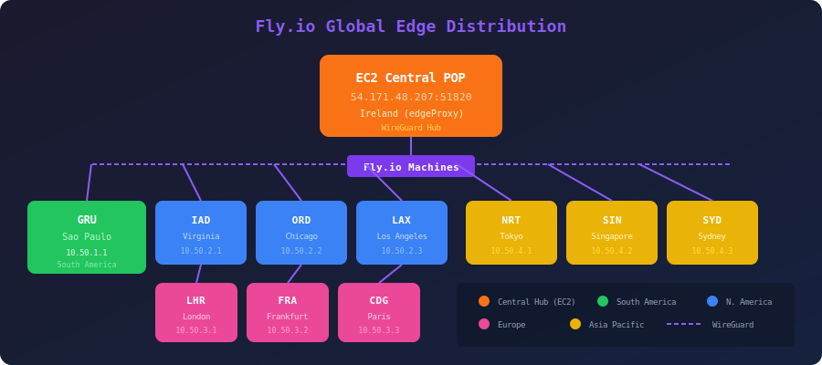
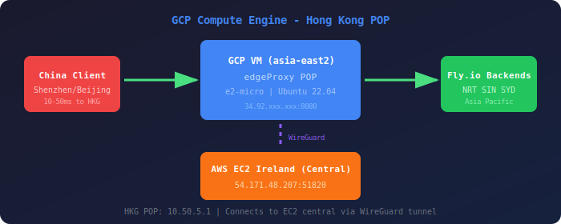
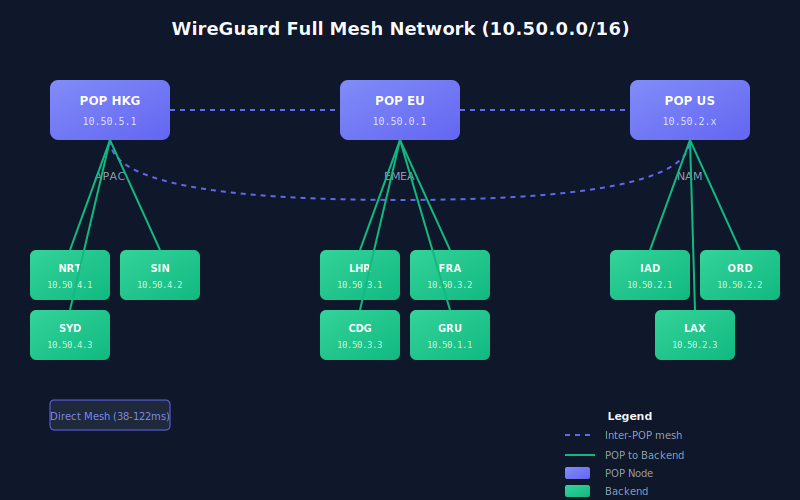

# edgeProxy

**Distributed TCP Proxy for Geo-Aware Load Balancing**

[](https://github.com/bassiandre/edgeproxy/releases)
[](LICENSE)
[](https://edgeproxy-docs.runner.codes)

**Documentation:** https://edgeproxy-docs.runner.codes

## What is edgeProxy?

edgeProxy is a **distributed TCP proxy** written in Rust, designed to operate at edge Points of Presence (POPs) worldwide. It routes client connections to the optimal backend based on geographic proximity, backend health, current load, and capacity limits.

## Why edgeProxy?

Built with the same patterns used by production edge platforms like Fly.io:

- **WireGuard Backhaul**: All internal communication flows over encrypted WireGuard tunnels
- **Rust + Tokio**: Predictable latency without GC pauses
- **Geo-Aware Routing**: Clients are routed to the nearest healthy backend
- **Client Affinity**: Session stickiness with configurable TTL

## Features

- **Geo-Aware Load Balancing**: Route clients to the nearest region using MaxMind GeoIP
- **Client Affinity**: Session stickiness with configurable TTL (default 10 minutes)
- **Weighted Load Balancing**: Configure backend weights for traffic distribution
- **Hot Reload**: Update routing.db without restarts
- **Connection Limits**: Soft and hard limits per backend
- **WireGuard Overlay**: Secure communication between POPs

## Architecture

<p align="center">
  
</p>

### Request Flow

<p align="center">
  
</p>

1. Client TCP connection arrives at edgeProxy
2. Check for existing binding (affinity)
3. If no binding: resolve client region via MaxMind GeoIP
4. Score all healthy backends within capacity
5. Select lowest-score backend
6. Create binding, connect via WireGuard overlay
7. Bidirectional TCP copy (L4 passthrough)

### Load Balancer Algorithm

Scoring system (lower = better):

```
score = region_score * 100 + (load_factor / weight)

where:
  region_score = 0 (client region match)
               = 1 (local POP region)
               = 2 (fallback/other)

  load_factor = current_connections / soft_limit
  weight = configured backend weight (higher = preferred)
```

## Quick Start

### Prerequisites

- Rust 1.75+
- SQLite 3.x
- WireGuard (for production multi-POP)

### Installation

```bash
# Clone the repository
git clone https://github.com/andrebassi/edgeproxy.git
cd edgeproxy

# Build
cargo build --release

# Run
./target/release/edge-proxy
```

### Docker

```bash
# Build and start multi-region environment
task docker-build
task docker-up

# Run tests
task docker-test

# View logs
task docker-logs
```

## Configuration

All configuration via environment variables:

| Variable | Default | Description |
|----------|---------|-------------|
| `EDGEPROXY_LISTEN_ADDR` | `0.0.0.0:8080` | TCP listen address |
| `EDGEPROXY_DB_PATH` | `routing.db` | Path to SQLite routing database |
| `EDGEPROXY_REGION` | `sa` | Local POP region identifier |
| `EDGEPROXY_DB_RELOAD_SECS` | `5` | Interval to reload routing.db |
| `EDGEPROXY_BINDING_TTL_SECS` | `600` | Client binding TTL (10 min) |

### Example

```bash
EDGEPROXY_REGION=us \
EDGEPROXY_LISTEN_ADDR=0.0.0.0:8080 \
./target/release/edge-proxy
```

## Deployment

### Fly.io (Recommended)

<p align="center">
  
</p>

Deploy globally with Fly.io's edge network:

```bash
# Launch and deploy
fly launch
fly deploy

# Scale to multiple regions
fly scale count 3 --region gru,iad,fra

# Check status
fly status
```

See [Fly.io Deployment Guide](https://edgeproxy-docs.runner.codes/docs/deployment/flyio) for details.

### AWS EC2

<p align="center">
  
</p>

Deploy on AWS with EC2 instances across regions:

```bash
# Cross-compile for Linux
cargo build --release --target x86_64-unknown-linux-gnu

# Deploy via SSH
scp target/x86_64-unknown-linux-gnu/release/edge-proxy ubuntu@<ip>:/opt/edgeproxy/

# Configure systemd service
sudo systemctl enable edgeproxy
sudo systemctl start edgeproxy
```

**Recommended Instances:**
- `t3.micro` for dev/test
- `c6i.large` for production
- Deploy in: `us-east-1`, `eu-west-1`, `sa-east-1`

See [AWS Deployment Guide](https://edgeproxy-docs.runner.codes/docs/deployment/aws) for details.

### Google Cloud Platform (GCP)

<p align="center">
  
</p>

Deploy on GCP Compute Engine:

```bash
# Cross-compile for Linux
cargo build --release --target x86_64-unknown-linux-gnu

# Create VM instance
gcloud compute instances create edgeproxy-hkg \
  --zone=asia-east2-a \
  --machine-type=e2-micro \
  --image-family=ubuntu-2204-lts \
  --image-project=ubuntu-os-cloud

# Deploy binary
gcloud compute scp target/x86_64-unknown-linux-gnu/release/edge-proxy edgeproxy-hkg:/opt/edgeproxy/
```

**Recommended Instances:**
- `e2-micro` for dev/test (free tier eligible)
- `n2-standard-2` for production
- Deploy in: `us-central1`, `europe-west1`, `asia-east2`

See [GCP Deployment Guide](https://edgeproxy-docs.runner.codes/docs/deployment/gcp) for details.

## WireGuard Configuration

<p align="center">
  
</p>

edgeProxy uses WireGuard as a **backhaul network** - a private, encrypted overlay that connects all POPs and backends. This is the same pattern used by Fly.io's internal network.

### Why WireGuard?

| Benefit | Description |
|---------|-------------|
| **Encryption** | All traffic between POPs is encrypted (ChaCha20-Poly1305) |
| **Performance** | Kernel-level implementation, minimal overhead (~3% CPU) |
| **Simplicity** | Single UDP port, no complex PKI |
| **NAT Traversal** | Works behind firewalls and NAT |

### Network Topology

```
10.50.0.0/16 - WireGuard Overlay Network
├── 10.50.0.0/24 - POPs (edgeProxy instances)
│   ├── 10.50.0.1 - POP SA (São Paulo)
│   ├── 10.50.0.2 - POP US (Virginia)
│   └── 10.50.0.3 - POP EU (Frankfurt)
├── 10.50.1.0/24 - SA Backends
├── 10.50.2.0/24 - US Backends
└── 10.50.3.0/24 - EU Backends
```

### Configuration Example

**POP SA (São Paulo) - /etc/wireguard/wg0.conf:**

```ini
[Interface]
PrivateKey = <SA_PRIVATE_KEY>
Address = 10.50.0.1/16
ListenPort = 51820
PostUp = sysctl -w net.ipv4.ip_forward=1

# POP US
[Peer]
PublicKey = <US_PUBLIC_KEY>
Endpoint = us-pop.example.com:51820
AllowedIPs = 10.50.0.2/32, 10.50.2.0/24
PersistentKeepalive = 25

# POP EU
[Peer]
PublicKey = <EU_PUBLIC_KEY>
Endpoint = eu-pop.example.com:51820
AllowedIPs = 10.50.0.3/32, 10.50.3.0/24
PersistentKeepalive = 25

# SA Backend 1
[Peer]
PublicKey = <SA_BACKEND1_PUBLIC_KEY>
AllowedIPs = 10.50.1.1/32
```

### Quick Setup

```bash
# Generate keys
wg genkey | tee privatekey | wg pubkey > publickey

# Enable WireGuard
sudo systemctl enable wg-quick@wg0
sudo systemctl start wg-quick@wg0

# Verify connectivity
wg show
ping 10.50.0.2  # Ping another POP
```

### Topologies Supported

| Topology | Use Case | Complexity |
|----------|----------|------------|
| **Hub-Spoke** | Single region with satellites | Low |
| **Full Mesh** | Multi-region with direct connectivity | Medium |
| **Hierarchical** | Large scale with regional hubs | High |

See [WireGuard Configuration Guide](https://edgeproxy-docs.runner.codes/docs/internals/wireguard) for complete setup instructions.

## Routing Database

The `routing.db` SQLite database contains backend configuration:

```sql
CREATE TABLE backends (
    id TEXT PRIMARY KEY,      -- "sa-node-1"
    app TEXT,                 -- "myapp"
    region TEXT,              -- "sa", "us", "eu"
    wg_ip TEXT,               -- WireGuard IP
    port INTEGER,             -- Backend port
    healthy INTEGER,          -- 0 or 1
    weight INTEGER,           -- Load balancing weight
    soft_limit INTEGER,       -- Comfortable connection count
    hard_limit INTEGER,       -- Maximum connections
    deleted INTEGER DEFAULT 0
);
```

### Example Data

```sql
INSERT INTO backends VALUES
    ('sa-node-1', 'myapp', 'sa', '10.50.1.1', 8080, 1, 2, 50, 100, 0),
    ('us-node-1', 'myapp', 'us', '10.50.2.1', 8080, 1, 2, 50, 100, 0),
    ('eu-node-1', 'myapp', 'eu', '10.50.3.1', 8080, 1, 2, 50, 100, 0);
```

## Supported Regions

| Code | Region |
|------|--------|
| `sa` | South America (Brazil, Argentina, Chile, etc.) |
| `us` | North America (USA, Canada, Mexico) |
| `eu` | Europe (Germany, France, UK, etc.) |
| `ap` | Asia Pacific (Japan, Singapore, Australia) |

## Hexagonal Architecture (Ports & Adapters)

edgeProxy follows **Hexagonal Architecture** (also known as Ports & Adapters), which provides clear separation between business logic and infrastructure concerns.

### Why Hexagonal Architecture?

| Benefit | Description |
|---------|-------------|
| **Testability** | Domain logic tested with simple mocks, no real databases needed |
| **Flexibility** | Swap implementations (SQLite → PostgreSQL) by creating new adapters |
| **Clarity** | Business rules live in `domain/`, infrastructure in `adapters/` |
| **Dependency Inversion** | Domain defines interfaces (traits), adapters implement them |

### Layer Diagram

```
┌─────────────────────────────────────────────────────────────────────────┐
│                          INBOUND ADAPTERS                               │
│                        (driving / primary)                              │
│  ┌───────────────────────────────────────────────────────────────────┐ │
│  │  TcpServer - accepts TCP connections, delegates to ProxyService   │ │
│  └───────────────────────────────────────────────────────────────────┘ │
└─────────────────────────────────────────────────────────────────────────┘
                                    │
                                    ▼
┌─────────────────────────────────────────────────────────────────────────┐
│                            APPLICATION                                   │
│                        (use cases / orchestration)                       │
│  ┌───────────────────────────────────────────────────────────────────┐ │
│  │  ProxyService - coordinates domain services and repositories       │ │
│  │  • resolve_backend() - finds best backend for client               │ │
│  │  • manage bindings - session affinity                              │ │
│  │  • track metrics - connection counts                               │ │
│  └───────────────────────────────────────────────────────────────────┘ │
└─────────────────────────────────────────────────────────────────────────┘
                                    │
                                    ▼
┌─────────────────────────────────────────────────────────────────────────┐
│                              DOMAIN                                      │
│                    (pure business logic - ZERO external dependencies)    │
│                                                                          │
│  ┌─────────────────┐  ┌─────────────────┐  ┌─────────────────────────┐ │
│  │    Entities     │  │  Value Objects  │  │       Services          │ │
│  │  • Backend      │  │  • RegionCode   │  │  • LoadBalancer         │ │
│  │  • Binding      │  │  • BackendScore │  │    - pick_backend()     │ │
│  │  • ClientKey    │  │                 │  │    - calculate_score()  │ │
│  │  • GeoInfo      │  │                 │  │                         │ │
│  └─────────────────┘  └─────────────────┘  └─────────────────────────┘ │
│                                                                          │
│  ┌───────────────────────────────────────────────────────────────────┐ │
│  │                     PORTS (Traits/Interfaces)                      │ │
│  │  • BackendRepository  - get backends from storage                  │ │
│  │  • BindingRepository  - manage client-backend bindings             │ │
│  │  • GeoResolver        - resolve IP to geographic info              │ │
│  │  • MetricsStore       - track connection metrics                   │ │
│  └───────────────────────────────────────────────────────────────────┘ │
└─────────────────────────────────────────────────────────────────────────┘
                                    ▲
                                    │ implements
┌─────────────────────────────────────────────────────────────────────────┐
│                         OUTBOUND ADAPTERS                                │
│                        (driven / secondary)                              │
│                                                                          │
│  ┌──────────────────────┐  ┌──────────────────────┐                    │
│  │ SqliteBackendRepo    │  │ DashMapBindingRepo   │                    │
│  │ impl BackendRepo     │  │ impl BindingRepo     │                    │
│  └──────────────────────┘  └──────────────────────┘                    │
│                                                                          │
│  ┌──────────────────────┐  ┌──────────────────────┐                    │
│  │ MaxMindGeoResolver   │  │ DashMapMetricsStore  │                    │
│  │ impl GeoResolver     │  │ impl MetricsStore    │                    │
│  └──────────────────────┘  └──────────────────────┘                    │
└─────────────────────────────────────────────────────────────────────────┘
```

### Ports (Interfaces)

Ports define what the domain needs, without specifying how:

```rust
// domain/ports/backend_repository.rs
#[async_trait]
pub trait BackendRepository: Send + Sync {
    async fn get_all(&self) -> Vec<Backend>;
    async fn get_by_id(&self, id: &str) -> Option<Backend>;
    async fn get_healthy(&self) -> Vec<Backend>;
    async fn get_version(&self) -> u64;
}

// domain/ports/binding_repository.rs
#[async_trait]
pub trait BindingRepository: Send + Sync {
    async fn get(&self, key: &ClientKey) -> Option<Binding>;
    async fn set(&self, key: ClientKey, binding: Binding);
    async fn remove(&self, key: &ClientKey);
    async fn touch(&self, key: &ClientKey);
    async fn cleanup_expired(&self, ttl: Duration) -> usize;
    async fn count(&self) -> usize;
}

// domain/ports/geo_resolver.rs
pub trait GeoResolver: Send + Sync {
    fn resolve(&self, ip: IpAddr) -> Option<GeoInfo>;
}

// domain/ports/metrics_store.rs
pub trait MetricsStore: Send + Sync {
    fn get_connection_count(&self, backend_id: &str) -> usize;
    fn increment_connections(&self, backend_id: &str);
    fn decrement_connections(&self, backend_id: &str);
    fn record_rtt(&self, backend_id: &str, rtt_ms: u64);
    fn get_last_rtt(&self, backend_id: &str) -> Option<u64>;
}
```

### Composition Root (main.rs)

The only place that knows all concrete implementations:

```rust
#[tokio::main]
async fn main() -> Result<()> {
    let cfg = Config::from_env()?;

    // Create adapters (concrete implementations)
    let backend_repo = Arc::new(SqliteBackendRepository::new(&cfg.db_path)?);
    let binding_repo = Arc::new(DashMapBindingRepository::new());
    let geo_resolver = Arc::new(MaxMindGeoResolver::embedded()?);
    let metrics = Arc::new(DashMapMetricsStore::new());

    // Create application service (uses trait objects)
    let proxy_service = Arc::new(ProxyService::new(
        backend_repo,    // impl BackendRepository
        binding_repo,    // impl BindingRepository
        geo_resolver,    // impl GeoResolver
        metrics,         // impl MetricsStore
        RegionCode::from_str(&cfg.region),
    ));

    // Create inbound adapter and run
    let server = TcpServer::new(proxy_service, cfg.listen_addr);
    server.run().await
}
```

### Testing Benefits

Domain logic tested with simple mocks (no real databases):

```rust
#[test]
fn test_pick_backend_prefers_same_region() {
    let backends = vec![
        make_backend("us-1", RegionCode::NorthAmerica, true),
        make_backend("sa-1", RegionCode::SouthAmerica, true),
    ];

    let client_geo = GeoInfo {
        country: "BR".to_string(),
        region: RegionCode::SouthAmerica,
    };

    // No real database or network needed!
    let result = LoadBalancer::pick_backend(
        &backends,
        &RegionCode::NorthAmerica,
        Some(&client_geo),
        |_| 0,  // Simple mock: zero connections
    );

    assert_eq!(result.unwrap().id, "sa-1");
}
```

### Extending the System

To add a new storage backend (e.g., PostgreSQL):

1. Create a new adapter:
```rust
// adapters/outbound/postgres_backend_repo.rs
pub struct PostgresBackendRepository { pool: PgPool }

#[async_trait]
impl BackendRepository for PostgresBackendRepository {
    async fn get_healthy(&self) -> Vec<Backend> {
        sqlx::query_as("SELECT * FROM backends WHERE healthy = true")
            .fetch_all(&self.pool).await.unwrap_or_default()
    }
}
```

2. Wire it in main.rs:
```rust
// Swap implementation - domain code unchanged!
let backend_repo = Arc::new(PostgresBackendRepository::new(pool));
```

## Project Structure

```
edgeproxy/
├── src/                             # Hexagonal Architecture
│   ├── main.rs                      # Composition Root
│   ├── config.rs                    # Environment configuration
│   ├── domain/                      # CORE BUSINESS LOGIC (no external deps)
│   │   ├── entities.rs              # Backend, Binding, ClientKey, GeoInfo
│   │   ├── value_objects.rs         # RegionCode, BackendScore
│   │   ├── ports/                   # INTERFACES (traits)
│   │   │   ├── backend_repository.rs
│   │   │   ├── binding_repository.rs
│   │   │   ├── geo_resolver.rs
│   │   │   └── metrics_store.rs
│   │   └── services/
│   │       └── load_balancer.rs     # Pure scoring algorithm
│   ├── application/                 # USE CASES / ORCHESTRATION
│   │   └── proxy_service.rs
│   └── adapters/                    # INFRASTRUCTURE IMPLEMENTATIONS
│       ├── inbound/
│       │   └── tcp_server.rs        # TCP listener
│       └── outbound/
│           ├── sqlite_backend_repo.rs
│           ├── dashmap_binding_repo.rs
│           ├── dashmap_metrics_store.rs
│           └── maxmind_geo_resolver.rs
├── sql/
│   └── create_routing_db.sql
├── assets/                          # SVG diagrams
├── docs/                            # Docusaurus documentation
├── docker/                          # Docker configurations
├── .tasks/                          # Modular task files
│   ├── build.yaml                   # Build & cross-compilation tasks
│   ├── test.yaml                    # Test tasks
│   ├── aws.yaml                     # AWS deployment
│   └── gcp.yaml                     # GCP deployment
├── Cargo.toml
├── Taskfile.yaml
└── README.md
```

## Performance

| Metric | Value |
|--------|-------|
| Cold Start | ~50ms |
| Connection Latency | <1ms overhead |
| Memory per 1K connections | ~10MB |
| Binary Size | ~5MB |
| WireGuard Overhead | ~3% CPU |

## Roadmap

edgeProxy is evolving towards a fully distributed, self-healing edge platform:

| Phase | Description | Status |
|-------|-------------|--------|
| Phase 1 | Internal DNS (.internal domains) | Planned |
| Phase 2 | Corrosion (distributed SQLite) | Planned |
| Phase 3 | Auto-Discovery | Planned |
| Phase 4 | IPv6 (6PN) | Planned |
| Phase 5 | Anycast BGP | Planned |
| Phase 6 | Active Health Checks | Planned |

See the full [Roadmap](https://edgeproxy-docs.runner.codes/docs/roadmap) for details.

## Development

### Build & Cross-Compilation

```bash
# Native builds
task build:release          # Optimized release build
task build:build            # Debug build

# Cross-compilation for deployment
task build:linux            # Linux AMD64 (servers, containers)
task build:linux-arm        # Linux ARM64 (Graviton, ARM servers)
task build:macos            # macOS (native arch)
task build:macos-universal  # macOS Universal (Intel + Apple Silicon)
task build:all              # Linux AMD64 + macOS native
task build:dist             # All platforms

# Setup cross-compilation targets
task build:targets:setup    # Install all Rust targets
task build:targets:list     # List installed targets

# Output binaries in ./dist/
# edge-proxy-linux-amd64
# edge-proxy-linux-arm64
# edge-proxy-darwin-arm64
# edge-proxy-darwin-amd64
# edge-proxy-darwin-universal
```

### Cross-Compilation Setup (macOS)

**IMPORTANT**: Use rustup for Rust, NOT Homebrew. Homebrew's Rust doesn't support cross-compilation.

```bash
# 1. Ensure Rust is via rustup
brew uninstall rust 2>/dev/null || true
curl --proto '=https' --tlsv1.2 -sSf https://sh.rustup.rs | sh

# 2. Install Linux linkers
brew tap messense/macos-cross-toolchains
brew install x86_64-unknown-linux-gnu

# 3. Build for Linux
task build:linux
```

### Testing

```bash
# Run all 102 unit tests
cargo test

# Run with output
cargo test -- --nocapture

# Run specific module tests
cargo test domain::services::load_balancer
cargo test adapters::outbound::dashmap_metrics_store
```

### Integration Testing with Mock Backend

The `tests/mock-backend/` directory contains a Go HTTP server for end-to-end testing:

```bash
# Build mock server
cd tests/mock-backend
go build -o mock-backend main.go

# Cross-compile for Linux (EC2 deployment)
GOOS=linux GOARCH=amd64 go build -o mock-backend-linux-amd64 main.go

# Run multiple mock backends
./mock-backend -port 9001 -region eu -id mock-eu-1 &
./mock-backend -port 9002 -region eu -id mock-eu-2 &
./mock-backend -port 9003 -region us -id mock-us-1 &
```

#### Mock Backend Endpoints

| Endpoint | Response |
|----------|----------|
| `/` | Text with backend info |
| `/health` | `OK - {id} ({region})` |
| `/api/info` | JSON with full details |
| `/api/latency` | Minimal JSON for latency testing |

#### Configure routing.db for Testing

```sql
INSERT INTO backends (id, app, region, wg_ip, port, healthy, weight, soft_limit, hard_limit)
VALUES
  ('mock-eu-1', 'test', 'eu', '127.0.0.1', 9001, 1, 2, 100, 150),
  ('mock-eu-2', 'test', 'eu', '127.0.0.1', 9002, 1, 2, 100, 150),
  ('mock-us-1', 'test', 'us', '127.0.0.1', 9003, 1, 2, 100, 150);
```

#### Backend Fields Reference

| Field | Description |
|-------|-------------|
| `id` | Unique backend identifier |
| `app` | Application name (groups backends) |
| `region` | Geographic region: `eu`, `us`, `sa`, `ap` |
| `wg_ip` | Backend IP (`127.0.0.1` for local, WireGuard IP for production) |
| `port` | TCP port |
| `healthy` | `1` = active, `0` = excluded from routing |
| `weight` | Load balancing weight (higher = more traffic) |
| `soft_limit` | Comfortable connection count |
| `hard_limit` | Maximum connections (excluded when reached) |

See [Testing Documentation](https://edgeproxy-docs.runner.codes/docs/testing) for complete guide.

### Docker Development

```bash
# Build images
task docker-build

# Start environment (3 POPs, 9 backends)
task docker-up

# Run tests
task docker-test

# Cleanup
task docker-down
```

## Documentation

Full documentation is available at [edgeproxy-docs.runner.codes](https://edgeproxy-docs.runner.codes)

- [Getting Started](https://edgeproxy-docs.runner.codes/docs/getting-started)
- [Architecture](https://edgeproxy-docs.runner.codes/docs/architecture)
- [Configuration](https://edgeproxy-docs.runner.codes/docs/configuration)
- [Testing](https://edgeproxy-docs.runner.codes/docs/testing)
- [Deployment](https://edgeproxy-docs.runner.codes/docs/deployment/docker)
- [WireGuard Setup](https://edgeproxy-docs.runner.codes/docs/internals/wireguard)
- [Internals](https://edgeproxy-docs.runner.codes/docs/internals/load-balancer)
- [Roadmap](https://edgeproxy-docs.runner.codes/docs/roadmap)

## Related Technologies

- **WireGuard**: Secure overlay network between POPs
- **Corrosion**: SQLite replication for distributed routing.db (planned)
- **MaxMind GeoLite2**: IP geolocation (embedded in binary)
- **Fly.io**: Recommended deployment platform

## Troubleshooting

### Connection Timeout

```bash
# Check backend health
sqlite3 routing.db "SELECT id, healthy FROM backends"

# Check WireGuard connectivity
wg show
ping 10.50.1.1
```

### No Backends Available

```bash
# Verify routing.db
sqlite3 routing.db "SELECT * FROM backends WHERE healthy=1"
```

### WireGuard Issues

```bash
# Check interface status
sudo wg show wg0

# Check routes
ip route | grep 10.50

# Test connectivity
ping -c 3 10.50.0.2
```

## License

[MIT](LICENSE)

## Author

Developed by [André Bassi](https://andrebassi.com.br)
